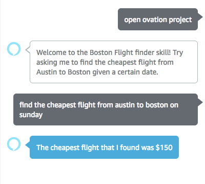

# Ovation Internship Technical Challenge

## Overview

This is an Amazon Alexa app that gives users the cheapest airline flight from Austin to Boston given a specific date.  
In order to accomplish this task, I needed access to an airfare API, or find a way to scrape an airfare website and modify the search query to have the specific date to obtain the correct info.

Initially, I looked towards scraping Kayak.com for the information by sorting the airfare by price and obtaining a list of all prices that were shown in the HTML request. [This tutorial](https://codeburst.io/an-introduction-to-web-scraping-with-node-js-1045b55c63f7) gave me a lot of good information on how to scrape a webpage via Javascript, but warned that there are things that cannot be parse due to modified DOMs. This might be a case where either the DOM is dynamically changed and cannot get access to the pricing information, or that the website itself is blocking any third-party javascript from doing shady things to their site.  

Fortunately, I was able to find an alternative website that enabled me to scrape their website in order to get the pricing information! Whoohoo! However, I ran into another problem.  

The script that I wrote to scrape the webpage for prices takes a lot longer than Alexa allows responses to take. According to the [Alexa API](https://developer.amazon.com/docs/device-apis/alexa-interface.html#response), Alexa only waits for 8 seconds before timing out. Boo. There are ways to get around this such as having Audio play (like elevator music) in order for the processing to finish, but isn't very practical.

As of right now, I have my parsing code commented out in the FindFlightIntent function to hopefully be functional in the near future.